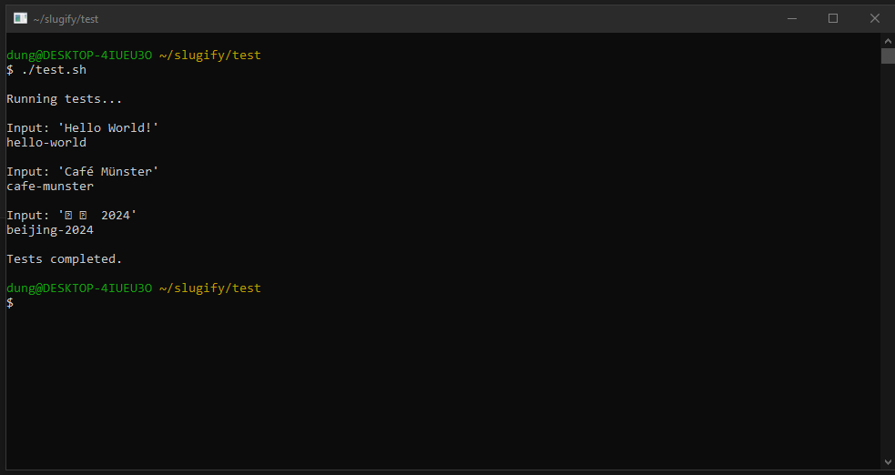
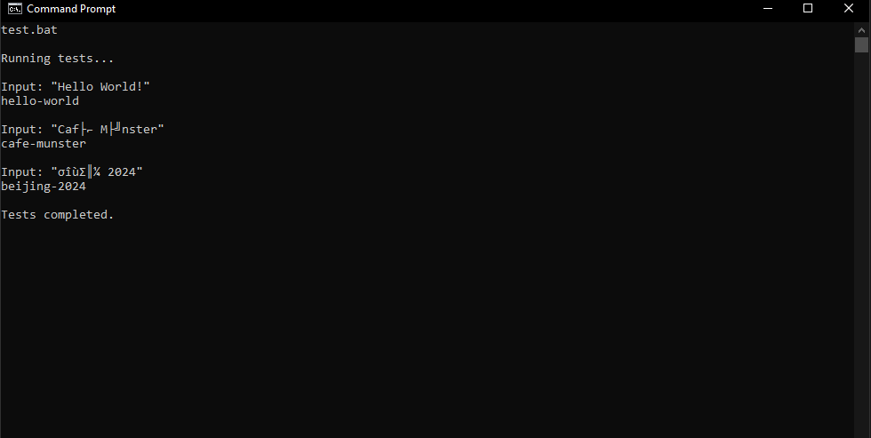

# Slugify

A Nim wrapper for the anyascii C library that provides ASCII transliteration for Unicode characters, useful for creating URL-safe slugs.

## Building

### With C (recommended for ease of compilation)

```bash
gcc main.c anyascii.c -o slugify
```

### With Nim

```bash
nim c slugify.nim
```

## Usage

Pipe input to the executable:

```bash
echo "Hello World!" | ./slugify
# Output: hello-world
```

## Examples

- `echo "Café Münster" | ./slugify` → `cafe-munster`
- `echo "北京 2024" | ./slugify` → `bei-jing-2024`

## Testing

Run the test script:

- On Windows: `.\test.bat`
- On Unix-like systems: `./test.sh`

### Screenshots



